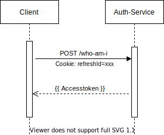
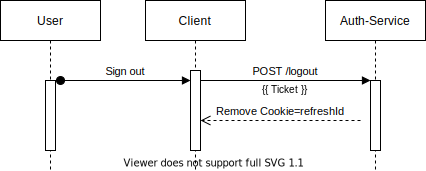
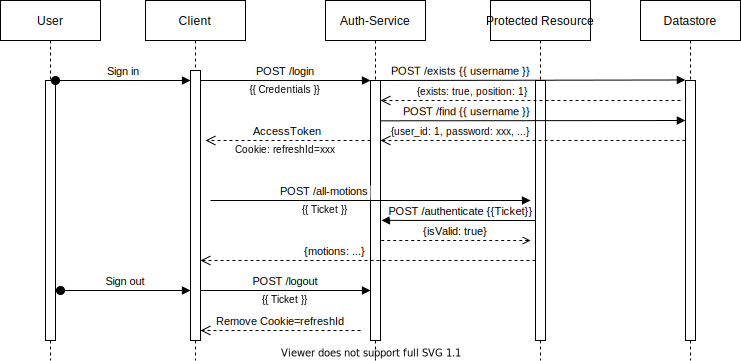

# OpenSlides authentication service

Service for OpenSlides which handles the authentication of users.

## Installation

You can setup the whole project simply by running `make build-dev`.

## Development

You can run just the command `make run-bash`.

This command will start the docker container and listen to changes in the `auth/src`-directory. Every time any file has changed, the container restarts and changes are applied immediately.

## Testing

If you want to run all tests, just run the command `make run-tests`.

### Working in test development

To test changes or working on tests, just run the command `make run-bash` (the same as for `Development`).

This will start a docker container, which is accessible with a bash. There, some commands can be run like

- `npm t`: To run tests written for node.js
- `pytest`: To run tests written for the pip-library

### Clean up the repo

To clean up the repo, just run the command `make run-cleanup`.

## Libraries

To avoid a separate request to the auth-service, you can install a library for a quick response.

Currently, only a pip-library is available:

Local install using pip: `pip install -e "git+ssh://git@github.com/OpenSlides/openslides-auth-service#egg=authlib&subdirectory=auth/libraries/pip-auth"`

## Workflows

Here, some example workflows are described:

### Complete workflow without connection to datastore

#### Workflow login

#### Who-am-I request

#### Workflow logout

#### Request protected resource

#### Complete workflow

