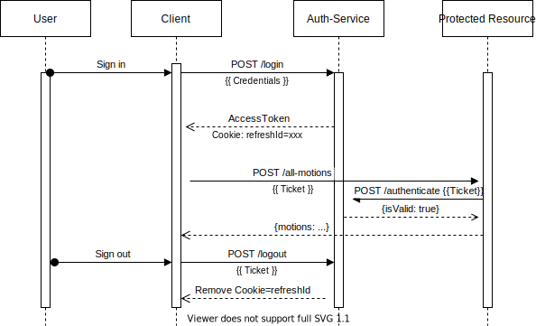
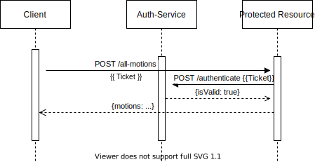

# OpenSlides authentication service

Service for OpenSlides which handles the authentication of users.

## Installation

You can setup the whole project simply by running `make build`.

## Production

For production purposes, you can just run the command `make prod`. This will ensures, that a production image is created and then starts the created image in a docker container.

Now, the server runs and is accessible on port `9004`.

## Development

You can run just the command `make dev`.

This command will start the docker container and listen to changes in the `auth/src`-directory. Every time any file has changed, the container restarts and changes are applied immediately.

## Testing

If you want to run all tests, just run the command `make test`.

## Networks

Docker-containers have to have access to the same network, to communicate to each other.

1. Create a network `foo` in container-1 with service A (called "service-A") under the network-tab

2. Add a network called `container-1_foo` with the property `external: true` in container 2 with service B (called "service-B") under the network-tab

3. As well service-A has to have the network `foo` under its network-tab as service-B has to have the network `container-1_foo` under its network-tab

4. Now service-A can communicate to service-B by calling `service-B`

## Workflows

Here, some example workflows are described:

#### Complete workflow without connection to datastore

#### Workflow login

#### Who-am-I request

#### Workflow logout

#### Request protected resource

#### Complete workflow

